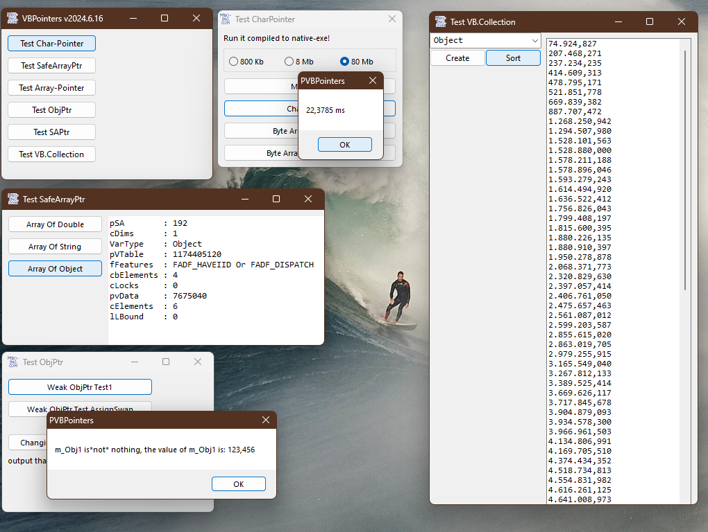

# Ptr_Pointers
## Everything we need for working with pointers  

 

Project started around mid 2006.   
The Module MPtr is used in many repos. It contains
* the Alias LongPtr for making code compatible with VBC / VBA7-x86-x64
* the universal pointer TUDTPtr-structure
* the TSafeArrayPtr-structure
* all GetMem/PutMem declarations
* every function for working with SafeArray-pointers
* Collection-functions including collection sorting
* weak obj-pointer functions
* the TByteSwapper-structure all byteswapping-and SwapByteOrder-functions 
[SwapByteOrder](https://www.activevb.de/rubriken/komponenten/dll31/dll31_neu.html) is a dll by the incredible Kai Liebenau he published at ActiveVB.de in august 2008.

